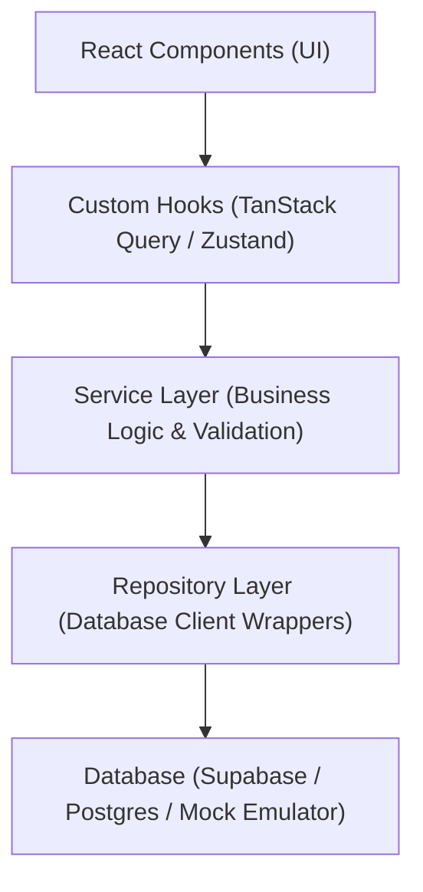

# Karya System Architecture Overview

This document outlines the software design patterns, folder structure, and decoupled layers established in the **Karya** backend foundation.

---

## 🏗️ Design Patterns & Layers

Karya's frontend codebase follows **Domain-Driven Design (DDD)** and a clean **Repository-Service-Hook** architecture to keep business logic completely decoupled from UI components.



### 1. Repository Layer (`src/repositories/`)
- Interacts directly with the database client (`supabase`).
- Filters all workspace operations automatically using `workspace_id` to ensure isolation.
- Handles CRUD transactions, soft-deletes, and complex nested relation fetching.
- Contains no business calculations or user validations.

### 2. Service Layer (`src/services/`)
- Encapsulates reusable business logic (e.g. GST calculations, Resend API dispatches, Bharat QR generation, storage paths).
- Executes input validation using the **Zod Schemas** before database repository writes.
- Manages transactional triggers like recording to `activity_logs`.
- Returns typed `Result<T, E>` payloads instead of throwing raw exceptions.

### 3. Hooks Layer (`src/hooks/`)
- Leverages `@tanstack/react-query` to provide reactive, cached query state to UI views.
- Handles query invalidation and optimistic updates.
- Exposes async actions wrapped in React Mutations.

---

## 📁 Workspace Folder Documentation

```
src/
├── app/
│   └── config/               # Environment variable startup validator
├── constants/                # Project workflow states (Lead -> Paid) & buckets
├── hooks/                    # TanStack Query custom data-access hooks
├── lib/                      # Supabase client & Mock DB query emulator
├── repositories/             # CRUD database wrapper classes
├── schemas/                  # Zod validation schemas for all schemas
├── services/                 # Business logic, GST calculators, QR & PDF makers
├── types/                    # database.types.ts & aggregate aggregates
└── styles/                   # Core Tailwind variables & dark styles
```

---

## 🔐 Security Architecture

- **Supabase Auth**: Enforces authentication on all non-public APIs.
- **Row-Level Security (RLS)**: Setup on all 13 PostgreSQL tables to prevent cross-workspace data leakage.
- **Client Portals**: Projects generate a unique, secure `portal_token` UUID allowing clients read-only access to their specific Proposal, Contract, Invoices, and Deliverables, and write access to upload UTR confirmations.
