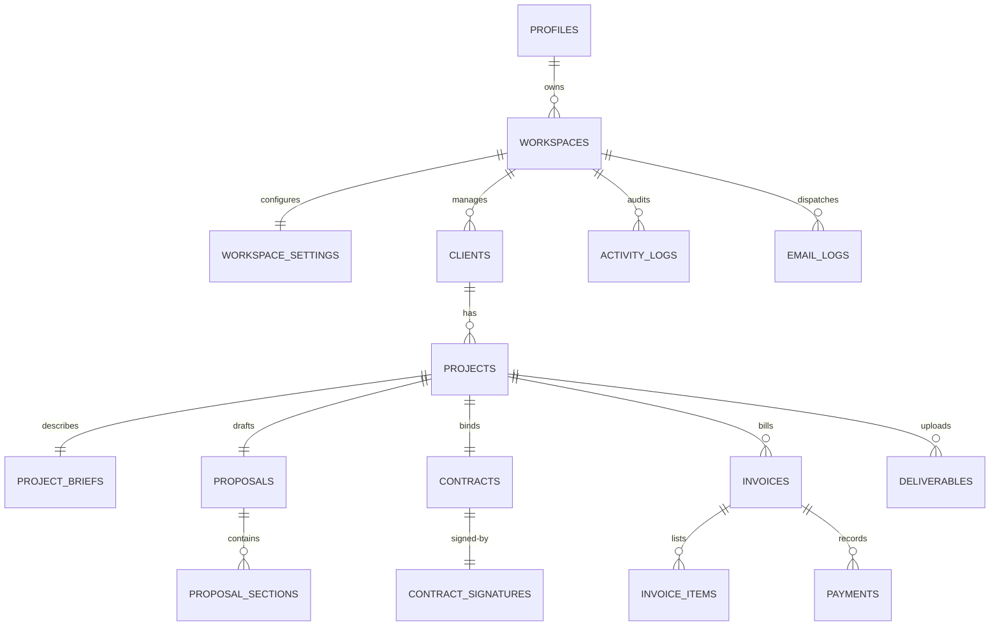

# Karya Database Schema & Migrations Documentation

This document describes the PostgreSQL database schema design, normalized tables, and security policy rules.

---

## 📊 Database Relationship Diagrams



---

## 🗄️ Normalized Database Tables

All tables utilize **UUID v4 primary keys** and include `created_at` / `updated_at` / `deleted_at` fields. Every record is associated with a `workspace_id` to support future multi-workspace scaling.

### 1. Profiles & Workspaces
- `profiles`: Syncs user identifiers from `auth.users` via database trigger functions.
- `workspaces`: Enforces the root multi-tenant model.
- `workspace_settings`: Contains company address details, banking IFSC code, bank accounts, default terms, and India UPI VPA address.

### 2. CRM & Project Pipelines
- `clients`: Tracks client contact information with support for soft-deletes (`deleted_at`).
- `projects`: Managed via 10-stage workflows (Lead, Proposal, Contract, Invoice, Delivered, Paid).
- `project_briefs`: Allows client to input project requirements and references.

### 3. Pitches & Agreements
- `proposals` & `proposal_sections`: Separates header scope details from multiple rich text sections.
- `contracts` & `contract_signatures`: Stores signed copy attachments, IP address of signer, legal names, and timestamp logs.

### 4. Billing & Payouts
- `invoices` & `invoice_items`: Calculates HSN codes and GST splits: CGST (9%) & SGST (9%) for intrastate clients, and IGST (18%) for interstate clients.
- `payments`: Tracks Indian transaction reference UTR numbers.

---

## 🔒 Row-Level Security (RLS) Rules

RLS is enabled globally on all tables. 

### 1. Owner Isolation
- Owner access is checked via:
  ```sql
  EXISTS (
      SELECT 1 FROM public.workspaces WHERE id = table.workspace_id AND profile_id = auth.uid()
  )
  ```
- This ensures a freelancer can never see, edit, or delete another freelancer's workspace contents.

### 2. Client Portal Token-Based Access
- Portal clients obtain read-only access (and insert access for submitting UTRs/briefs) by presenting a valid `portal_token` UUID mapping to the target project:
  ```sql
  EXISTS (
      SELECT 1 FROM public.projects WHERE id = table.project_id AND portal_token IS NOT NULL
  )
  ```
